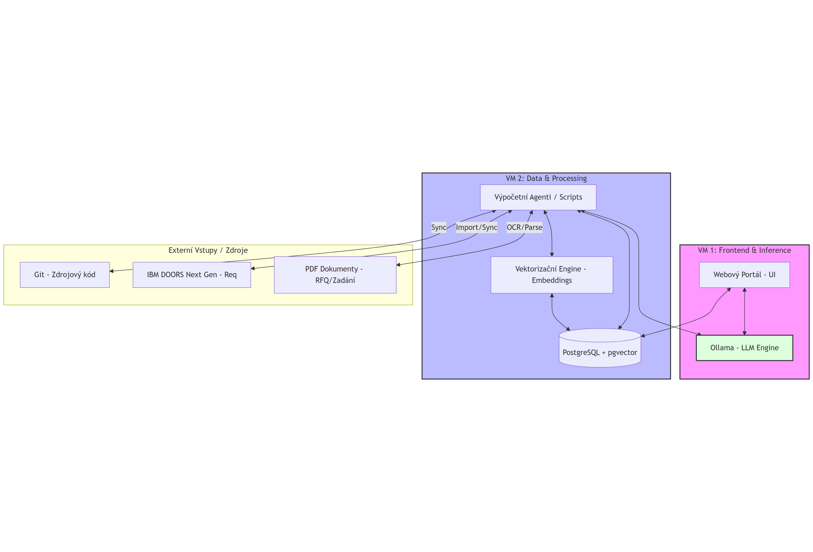
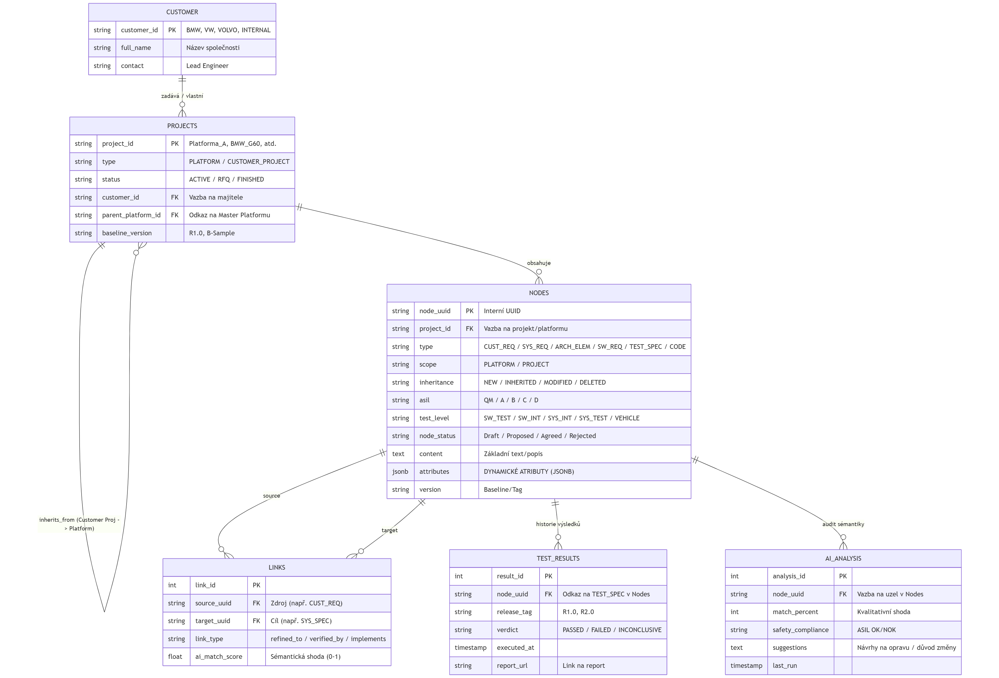
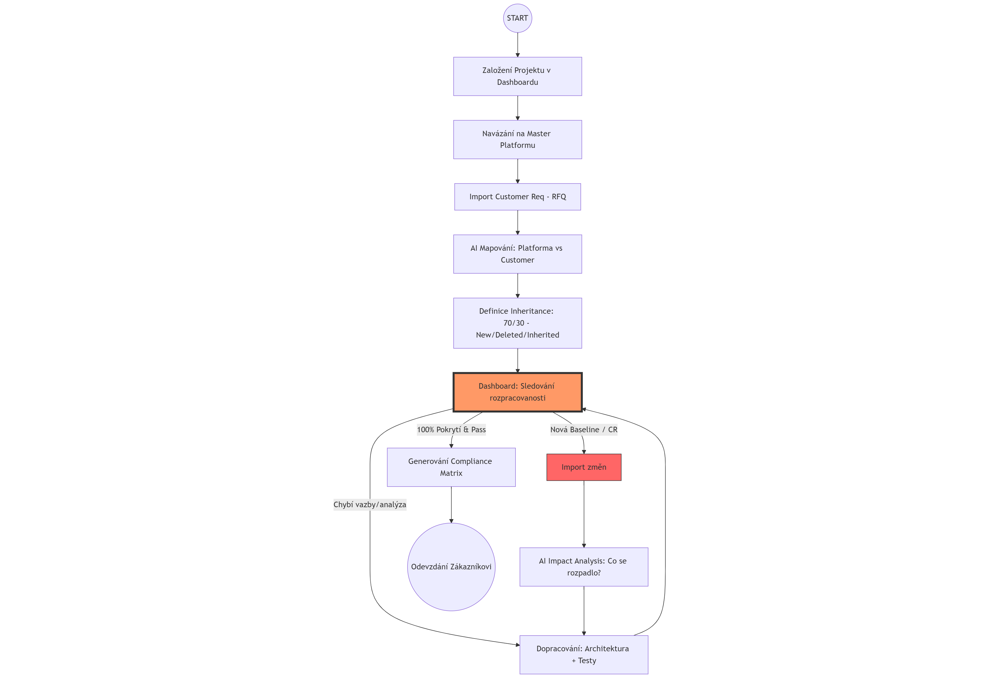
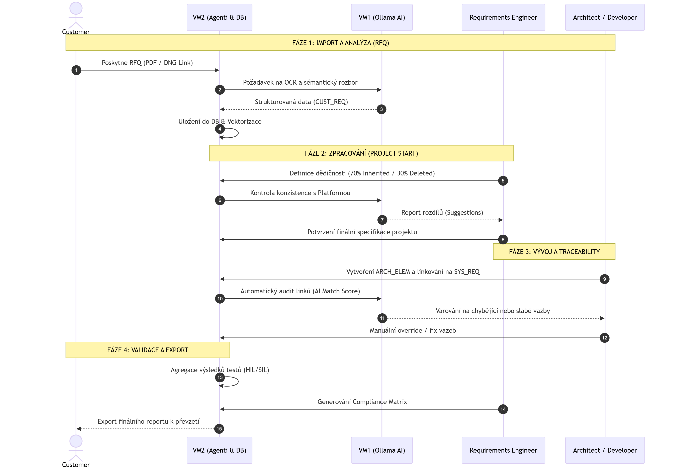

# Automotive Assistance Tool (AAT)

Projekt pro správu kvality a monitorování automotive projektů.

## 🚀 Aktuální stav (Change Log)

- [x] **v0.6.0** (2026-01-11) - **Add Conection to Ollama**
  - [x] * **Externí konektivita**: Webová aplikace je nyní propojena s Ollama službou běžící na externí IP `168.119.122.36`.
  - [x] * **Diagnostický Sidebar**: Přidán vizuální status spojení (Online/Offline) a kontrola přítomnosti modelu `llama3`.
  - [x] * **Load Model Tool**: Integrované tlačítko pro automatické stažení modelu (Pull API), pokud na serveru chybí.
  - [x] * **Optimalizace stability**: Oprava timeoutů a build skriptů pro úspěšný deploy.

### Technické nastavení
Pro správnou funkci musí mít cílový server s Ollamou povolený poslech na `0.0.0.0` a nastavené `OLLAMA_ORIGINS` pro IP adresu webového serveru.

- [x] **v0.5.0** (2026-01-11) - **Add DB schema**
  - [x] DB conected, zobrazen počet tabulek i obsah první s nenulovmi daty
- [x] **v0.4.0** (2026-01-09) - **Multi-Node Resource Monitoring**
  - [x] Implementace distribuovaného monitoringu (CPU, RAM, Disk)
  - [x] Zprovoznění Bridge API na portu 5000 pro sběr telemetrie
  - [x] Automatizace nasazení agentů přes GitHub Actions na více VM
  - [x] Vizualizace stavu uzlu Hetzner-Ollama-02 na centrálním dashboardu
- [x] **v0.3.0** - Ollama Chat online. První chat s Ollamou.
- [x] **v0.2.0** - Docker Migration & CI/CD Setup
- [x] **v0.1.0** - Inicializace projektu, základní Streamlit layout

## 🏗️ Architektura Systému (v0.4.0)
Systém nyní běží v distribuovaném režimu napříč Hetzner Cloud uzly:








1. **Centrální Dashboard & Bridge (`hetzner-vm-1`)**:
   - **IP**: `128.140.108.240`
   - **Port**: `5000` (Bridge API přijímající JSON data)
   - **Role**: Agregace dat a vizualizace stavu všech serverů.

2. **Monitorovaný AI Uzel (`Hetzner-OL-02`)**:
   - **IP**: `168.119.122.36`
   - **Služba**: `hetzner-monitor.service` (Python agent)
   - **Role**: Sběr systémových metrik a odesílání na Bridge přes HTTP POST.

## 🏷️ Release History & Tags

| Tag | Datum | Popis změn |
| :--- | :--- | :--- |
| **v0.6.0** | 2026-01-11 | **OLLAMA conected**. Připojena Olama, jako jednoduché chatovaí okno. |
| **v0.5.0** | 2026-01-11 | **DB conected**. Připojen DB a založeny tabulky. |
| **v0.4.0** | 2026-01-09 | **Resource Monitoring**. Propojení uzlů a real-time monitoring HW prostředků. |
| **v0.3.0** | 2026-01-09 | **Ollama Chat online**. První funkční integrace LLM. |
| **v0.2.0** | 2026-01-09 | **Docker Build & Deploy**. Automatizace nasazení přes GitHub Actions. |
| **v0.1.0** | 2026-01-08 | **Initial Layout**. Základní struktura aplikace. |


## 🛠️ Administrace (Monitoring Setup)

### Instalace agenta na nový uzel:
Služba monitoru běží jako systemd unit:
```bash
# Sledování logů odesílání dat
sudo journalctl -u hetzner-monitor -f